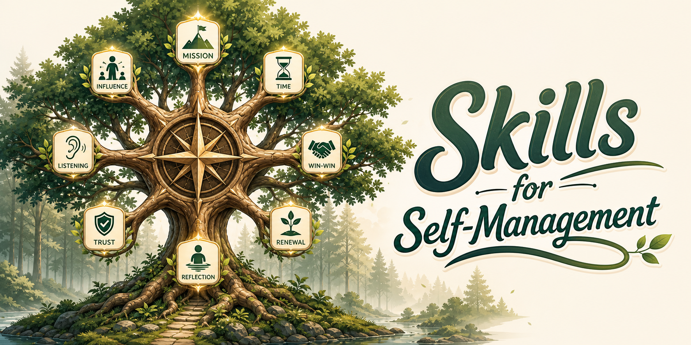

# Skills for Self-Management

[English](README.md) | [中文](README.zh.md)

<p align="center">
  
</p>

> A Claude Agent Skills collection based on Stephen Covey's *The 7 Habits of Highly Effective People*.
> Designed to help you audit your mission statement, long-term plans, and weekly schedule from a principled viewpoint — and surface the blind spots you can't see on your own.


---

Thanks to [sethmblack/skill-stephen-covey](https://github.com/sethmblack/skill-stephen-covey) for the original inspiration.

---

## What is this?

A set of Agent Skills designed for Claude that break Covey's 7 Habits framework into **8 independent, composable sub-skills**. Treat them as **principle-driven reviewers, each with its own lens** — when you already have a mission statement, a long-term plan, or a weekly schedule, you can have Claude play Covey and audit your planning system for gaps, blind spots, and drift.

**This skill set is best for:**
- People who already have a mission statement, 5-year / 1-year / quarterly / weekly plans
- People who want a recurring review cadence for their planning system
- People who want AI as a **thinking coach**, not a **task manager**

**Not a good fit for:**
- People expecting the AI to manage tasks or send reminders (this is not a task manager)
- People who have never written a personal plan and want the AI to guide them from zero (you can use it, but it'll be slow)

---

## Companion tooling

If you want to automate the review loop further (read a Lark weekly table → compare against execution → auto-draft next week's plan and write it back to Lark), pair this with [life-review-os](https://github.com/alexli-77/life-review-os) — a Weekly Review automation skill built on the same Covey framework.

---

## Quick start

### Prerequisites

- Claude Desktop or Claude Code (CLI)
- Code Execution permission enabled
- Some familiarity with the 7 Habits (not strictly required — Claude fills in the framework)

### Install

**Desktop (Claude Desktop / Cowork):**

1. Download this repo
2. Zip each sub-skill folder individually (or just the ones you want)
3. Open Claude Desktop → Customize → Skills → "+" → Upload a skill
4. Upload each ZIP

**CLI (Claude Code):**

```bash
# Clone into your Claude workspace
cd ~/claude_workspace
git clone https://github.com/alexli-77/skills-self-management.git

# Or drop into your project's .claude/skills/
cd your-project
mkdir -p .claude/skills
cp -r path/to/skills-self-management/* .claude/skills/
```

---

## Repository layout

```
skills-self-management/
├── stephen-covey/                      # Main persona + sub-skill dispatcher
├── circle-of-influence/                # Habit 1 · Be Proactive
├── life-center-diagnosis/              # Habit 2 prerequisite · diagnose current life-center
├── personal-mission-statement/         # Habit 2 · Begin with the End in Mind
├── quadrant-ii-time-management/        # Habit 3 · Put First Things First
├── win-win-agreement/                  # Habit 4 · Think Win-Win
├── seek-first-to-understand/           # Habit 5 · Seek First to Understand
├── emotional-bank-account/             # Foundation for Habits 4-6 · trust management
└── sharpen-the-saw/                    # Habit 7 · Sharpen the Saw
```

### What each sub-skill does

| Sub-skill | Habit | Core use |
|---|---|---|
| **stephen-covey** | dispatcher | Coordinates the other skills, provides the Covey persona |
| **circle-of-influence** | Habit 1 | Pull energy back from the Circle of Concern to the Circle of Influence |
| **life-center-diagnosis** | Habit 2 prereq | Identify what's currently anchoring you, redirect toward a principle-center |
| **personal-mission-statement** | Habit 2 | Build / audit a personal mission statement |
| **quadrant-ii-time-management** | Habit 3 | Diagnose where time is going, focus on Q2 |
| **win-win-agreement** | Habit 4 | Design win-win structures for negotiations and agreements |
| **seek-first-to-understand** | Habit 5 | Empathic listening, break communication deadlocks |
| **emotional-bank-account** | Habits 4-6 | Diagnose and repair relational trust |
| **sharpen-the-saw** | Habit 7 | Four-dimensional burnout assessment and recovery |

---

## Primary use case: review your existing planning system

If you already have a full planning system (mission → 5-year → 1-year → quarterly → weekly), the highest-value way to use this skill set is **periodic review**.

### Recommended review cadence

| Frequency | What to review | Time | Skills invoked |
|---|---|---|---|
| **Every Sunday evening** | This week's plan vs. quarterly plan | 20 min | `quadrant-ii` + `circle-of-influence` |
| **First of every month** | This month's progress vs. annual plan | 1 hour | `personal-mission` + `quadrant-ii` |
| **End of each quarter** | Quarterly retrospective + next-quarter plan | 2 hours | full set |
| **December annually** | 5-year plan adjustment / mission statement refresh | half-day | `personal-mission` + `sharpen-the-saw` |

---

## Three review modes

### Mode A: Vertical-alignment check

**For:** quarterly / annual reviews

**What it does:** Walk top-down through every level of the plan and check whether each item actually serves the level above it — surfacing "zombie tasks" and "missing priorities".

**Prompt template:**

```
You are Stephen Covey. Check the vertical alignment of my planning system:

1. Does every item in my 5-year plan trace back to my mission statement?
2. Does every item in my 1-year plan trace back to my 5-year plan?
3. Does every item in my quarterly plan trace back to my 1-year plan?
4. Does every item in my weekly plan trace back to my quarterly plan?

Surface the gaps:
- Zombie tasks: things I'm doing that don't trace upward
- Missing priorities: things called out in my mission that have disappeared from lower levels

Point out the problems directly, in Covey's voice. Don't soften it.
```

---

### Mode B: Quadrant-distribution check

**For:** weekly planning review

**What it does:** Sort this week's tasks into Q1-Q4 quadrants and identify whether you're stuck in the urgency trap.

**Prompt template:**

```
Audit my weekly plan with the Q2 framework:

1. Classify every task into Q1 / Q2 / Q3 / Q4.
2. Compute the time share of each quadrant.
3. Diagnose:
   - Is Q2 share healthy (target 60-70%)?
   - Which Q3 tasks can be declined or delegated? Give me actual decline scripts.
   - Which Q1 tasks could have been prevented by earlier Q2 investment?
4. Recommend the "big rocks" — protected time blocks I must defend this week.

Speak from Covey's POV. Give me concrete, executable adjustments.
```

---

### Mode C: Circle-of-Influence diagnostic

**For:** quarterly / annual goal review

**What it does:** Decide whether a goal sits inside what you can control, and rewrite "Circle of Concern" framings into "Circle of Influence" framings.

**Prompt template:**

```
Audit my [annual / quarterly] goals with the Circle of Influence model.

For every goal:
1. Decide: is this in my Circle of Influence, or my Circle of Concern?
2. If in Circle of Influence: what is the specific action under my control?
3. If in Circle of Concern (depends on others or external conditions):
   - Surface the slice I can actually control.
   - Rewrite it into the "Circle of Influence version".

Example:
- Concern: "Grow product to 100k users"
- Influence: "Ship 2 retention features per month + 3 user interviews per week"
```

---

## Other use cases

Beyond planning review, this skill set is also useful for:

### Relationship diagnostic

**Trigger:** Tension or eroded trust with someone

```
Use emotional-bank-account to diagnose my relationship with [person]:
- What are the recent deposits and withdrawals?
- What's the current account balance?
- Prescribe a concrete deposit plan for the next week / month.
```

### Breaking a conversation deadlock

**Trigger:** Repeatedly arguing about the same thing with the same person

```
I keep arguing with [person] about [topic].
Use seek-first-to-understand to:
1. Diagnose each side's listening level.
2. Identify my autobiographical responses.
3. Give me concrete empathic-response scripts for the next conversation.
```

### Burnout recovery plan

**Trigger:** Exhausted but can't stop

```
I've been [working/studying/building] for [duration] and feel [specific symptoms].
Use sharpen-the-saw to do a four-dimensional assessment and prescribe a minimum
renewal plan for the next week.
```

### Negotiation structure design

**Trigger:** Preparing for a high-stakes negotiation with boss / client / partner

```
I need to negotiate [topic] with [person].
Use win-win-agreement to:
1. Diagnose the real needs of both sides (not just stated positions).
2. Design the five elements of a win-win agreement.
3. Draft a "no deal is better" condition.
```

---

## Best practices

### 1. Drop your planning docs into a Claude Project

Create a Claude Project (e.g., "Life Management") and load these into Knowledge:

```
01-mission-statement.md       # Mission statement
02-five-year-plan.md          # 5-year plan
03-yearly-plan-2026.md        # Annual plan
04-q2-2026-plan.md            # Quarterly plan
05-weekly-plan-current.md     # Current weekly plan
```

That way Claude reads the full picture every review, with no doc-pasting.

### 2. Call the skill explicitly

Claude will auto-detect triggers, but explicit invocation works better:

```
# Preferred
"Use quadrant-ii-time-management to review my weekly plan"

# Works but less precise
"Take a look at my weekly plan"
```

### 3. Accept uncomfortable feedback

Covey's perspective punctures self-justification. Common moments of sting:

- *"Your 1-year plan has 12 goals. That's not a plan, that's a wish list."*
- *"Of 23 tasks this week, only 2 are Q2. Next week you'll say 'no time for important things' again."*
- *"'Family' is #2 on your mission statement. It's nowhere in your plan."*

**Don't delete these.** This is the feedback you pay coaches for.

### 4. Schedule the review itself as a Q2 activity

Reviews don't happen on their own. Block them in the calendar:

- Sun 21:00–21:20 → weekly review
- 1st of month 09:00–10:00 → monthly review
- Last Sunday of the quarter, mornings → quarterly review

---

## Why 8 files instead of 1?

This skill set started as a single 2943-line skill file. Reasons for splitting:

1. **Context efficiency:** Claude loads only the sub-skills it needs — no wasted context window
2. **Maintainability:** Updates to one skill don't ripple
3. **Mix-and-match:** You can use 3 of them, no need to install the full set
4. **Skill spec alignment:** Anthropic recommends single-responsibility skills

The original single-file version comes from [sethmblack/paks-skills](https://github.com/sethmblack/paks-skills). This repo is an MIT-licensed restructure with:

- Split into 8 independent skills
- Full Chinese localization (framework, examples, prompts) — see [README.zh.md](README.zh.md)
- Tuned `description` fields for better auto-triggering
- Added "conversation mode / deep-analysis mode" dual output
- Cultural adaptation notes for Chinese-context usage

---

## Limitations

### What this skill set can do

- ✅ Audit your plans from Covey's perspective
- ✅ Diagnose time distribution, relational health, burnout level
- ✅ Output structured reports and concrete next steps
- ✅ Provide a principled lens for communication, negotiation, decisions

### What it can't do

- ❌ **Doesn't store your data:** every new conversation starts blank (pair with a Claude Project)
- ❌ **Doesn't track task state:** whether you did it today, current progress — it doesn't know
- ❌ **Doesn't send reminders:** it's a consultant, not a secretary
- ❌ **Doesn't replace a real coach:** for major life decisions it's an aid, not the decision-maker

### One honest note

The biggest enemy of personal planning isn't methodology — it's **consistency**.

This skill set will feel great the first time you review. Six months later you'll probably forget about it. The thing that actually works is making the review itself a Q2 activity — defended in your calendar, every time.

Covey's own framing: ***"Sharpening the saw must be scheduled, or it never happens."***

---

## Contributing

Issues and PRs welcome. Especially:

- Translations into other languages
- New review prompt templates
- Use cases and field reports

---

## License

MIT License. Restructured from [sethmblack/paks-skills](https://github.com/sethmblack/paks-skills).

---

## Further reading

- 📖 *The 7 Habits of Highly Effective People* — Stephen R. Covey
- 📖 *First Things First* — Stephen R. Covey
- 📖 *The Speed of Trust* — Stephen M.R. Covey
- 🔗 [Anthropic Skills docs](https://docs.claude.com/en/docs/claude-code/skills)
- 🔗 [Anthropic official Skills repo](https://github.com/anthropics/skills)

---

*"The key is not to prioritize what's on your schedule, but to schedule your priorities."*
*— Stephen R. Covey*
